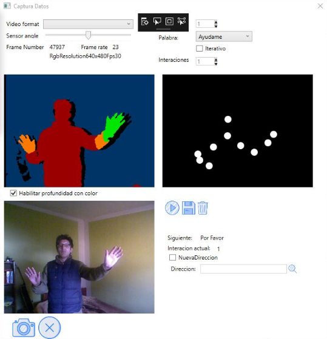
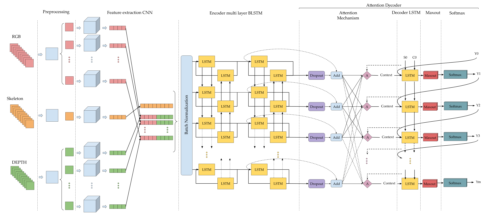
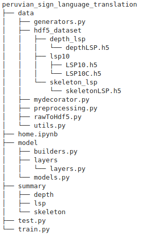

# Machine translation network for peruvian sign language recognition
<html>
   <body>
      <p style="text-align:justify;">La lengua de señas se percibe a través de la vista y requiere el uso de la cabeza, cuello, torso y brazos para transmitir información bajo un espacio temporal. Como cualquier otra lengua el LSP está conformado por una sintaxis, gramática y léxico diferentes del idioma oficial. El 2003 se propuso la iniciativa de educación inclusiva para personas sordas, pero no tuvo un efecto, posteriormente el ministerio de educación MINEDU, cambio el panorama y la ley 29535 dio su reconocimiento a la lengua de señas para la investigación, difusión y enseñanza para personas sordas por intérpretes acreditados. Sin embargo actualmente el LSP se encuentra dentro de las lenguas minoritarias del Perú según la Dirección General de Educación Básica Especial las personas con discapacidad auditiva se ven en la necesidad de aprender esta lengua para interactuar en la sociedad a diferencia del resto de personas que no sufren de esta discapacidad y no tienen la necesidad de aprender esta lengua, por lo que se crea una barrera en la comunicación, pese a las legislaciones del estado es muy común ver la indiferencia a esta comunidad, ya sea voluntaria o involuntariamente. Mediante técnicas de Deep Learning1 se facilita la interpretación del LSP y con una mejora en la tasa de precisicion2 frente a modelos similares, se construye un traductor unidireccional que permita captar las señas de una persona con un dispositivo e interpretarlas en nuestro idioma. Por otro lado, se genera un dataset de vıdeos de 10 señas almacenados en 100 frames aproximadamente cada uno. El modelo de solución alimenta a la arquitectura con datos generados por un sensor Kinect, el sensor es capaz de generar un video compuesto por tres tipos de datos: frames RGB, Depth y Skeleton, los datos son agrupados según el modelo para extraer las características de cada frame y posteriormente alimentan la parte recurrente encargada de la traducción. Finalmente, nuestro modelo propuesto obtuvo una tasa de exactitud de 99.23 % siendo una tasa muy aceptable que contribuirá a futuros trabajos dentro de este campo.</p>
   </body>
    <a href="http://repositorio.unsaac.edu.pe/handle/UNSAAC/4262">Fuente</a> 
</html>

## Recoleccion de datos

El software para la recolecion de datos se desarrollado en <a href="https://docs.microsoft.com/en-us/visualstudio/designers/getting-started-with-wpf?view=vs-2019">WPF</a>, hace uso del sensor kinect v1 para obtener los datos rgb, profundidad y esqueleto.
<div class="row">
  <div class="column" style="width: 100%;  text-align:center">
      <div>
          
      </div>
      <span>Software para recolectar datos rgb, depth y esqueleto.</span>
      <br>
  </div>
    <h3 style ="text-align:right"><a href="https://github.com/vladiH/recorder-LSP">download code</a> </h3>
</div>
<p style ="font-size: smaller; text-align:right"><small>Desarrollado por: Yuri Huallpa vargas y Naysha diaz ccasa</small></p>

## Modelo
<div class="row">
  <div class="column" style="width: 100%;  text-align:center">
      <div>
          
      </div>
      <span>Arquitectura propuesta para la traduccion automatica de la lengua de señas del Peru al idioma español.</span>
      <br>
      <span>Fuente:propia</span>
  </div>
</div>
<h3 style ="text-align:right"><a href="https://github.com/vladiH/peruvian_sign_language_translation">download code</a> </h3>

## Estructura
<div class="row" style="width: 100%;  text-align:center">
  <div class="column" style="width:30%; margin:0 auto;">
      <div>
          
      </div>
      <span>home.ipynb is the main file</span>
  </div>
</div>

## Requerimientos
<ul>
  <li>tensorflow v2</li>
  <li>numpy</li>
  <li>h5py</li>
  <li>tqdm</li>
  <li>pandas</li>
  <li>matplotlib</li>
  <li>multiprocessing</li>
  <li>sklearn</li>
  <li>openCV</li>
  <li>python 3</li>
  <li>Memoria ram > 4GB </li>
  <li>GPU vram > 12GB para el entrenamiento </li>
</ul>  


```python

```
